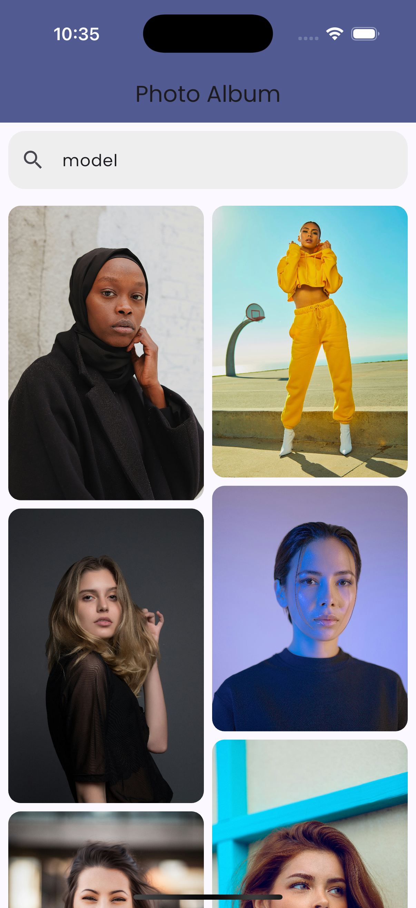

# Photo Album App

A Flutter-based photo album application that allows users to view images, search for photos, and view them in full-screen mode with smooth transitions. The app utilizes caching for smooth performance, and images are loaded with an elegant shimmer effect before the final content is displayed.


## Features
- **Search functionality**: Search photos in the album.
- **Full-screen viewing**: View images in full-screen mode with smooth transitions.
- **Caching**: Uses `cached_network_image` to cache images for faster loading.
- **Smooth transitions**: Elegant fade-in/fade-out transitions and shimmer effect for loading images.

## Tech Stack
- **Flutter** - Framework for building natively compiled applications.
- **Dio** - HTTP client for making API requests.
- **BLoC (Cubit)** - State management solution.
- **CachedNetworkImage** - Image caching to improve performance.
- **Shimmer** - Loading skeleton for smooth loading effects.
- **PhotoView** - To view photos in full-screen with pinch-to-zoom.

## Screenshots

| **Main Screen** |
|-----------------|
|  |

| **Full-Screen Photo View** |
|----------------------------|
|  |

## Installation

Follow these steps to set up the app locally:

### Prerequisites
Make sure you have Flutter installed on your machine. If not, follow the installation guide from the official Flutter website: [Flutter Installation](https://flutter.dev/docs/get-started/install)

### 1. Clone the repository
First, clone this repository to your local machine:
```bash
git clone https://github.com/yourusername/photo_album_app.git
cd photo_album_app
